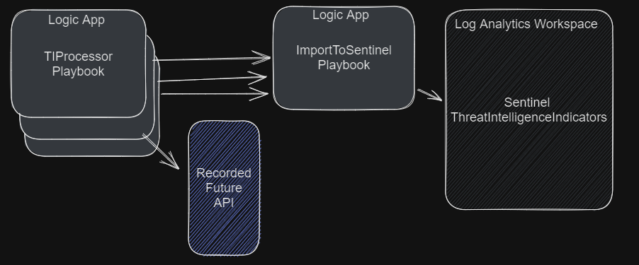
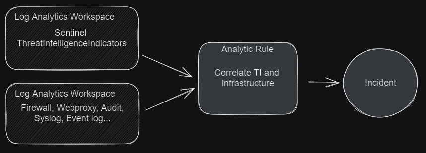
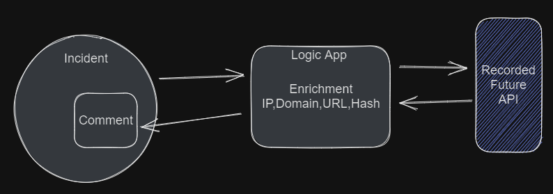
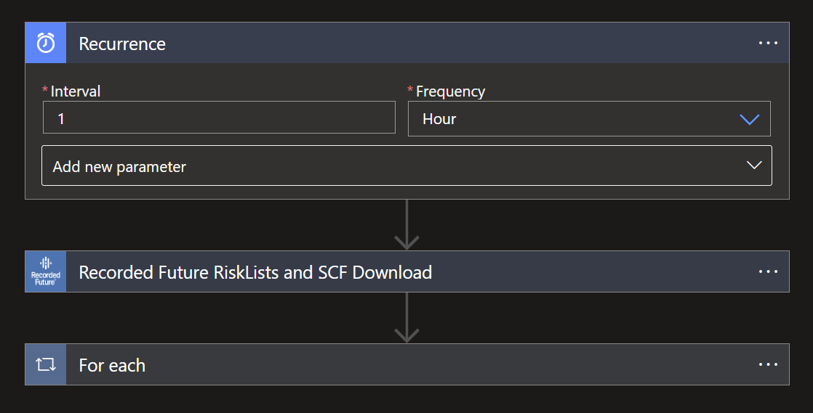

# Recorded Future - Import Indicators Logic Apps and IOC Enrichment Playbook templates


# Overview
Recorded Future is the world’s largest provider of intelligence for enterprise security. By combining persistent and pervasive automated data collection and analytics with human analysis, Recorded Future delivers intelligence that is timely, accurate, and actionable.

The Recorded Future Microsoft Sentinel Integration will supercharge Sentinel by integrating intelligence from Recorded Future. 

**Benefits** 
- Detect risky IOCs in your environment.
- Triage alerts faster with elite, real-time intelligence.
- Respond quickly with transparency and context around internal telemetry data.
- Maximize your investment in Microsoft Sentinel.

For more information see: [How to Apply Elite Intelligence to Microsoft Azure Sentinel](https://www.recordedfuture.com/microsoft-azure-sentinel-integration)


# Use cases
The playbooks provided in Recorded Future Solution support use case for detection and incident response.
## Detection - Risk list 

The TIProcessor will pull the configured risk list from Recorded Future and write indicator in batches to Sentinels ThreatIntelligenceIndicator table. 

Analytic rules will correlate ThreatIntelligenceIndicators with logs provided to Sentinel and create alerts with will surface as incidents in Sentinel.


## Response - Enrichment 

Automation rules will trigger on each incident and enrich incidents with Recorded Future intelligence. 


# Risk lists
Risk lists is how we transfer accurate and current threat intelligence to Microsoft Sentinel as ThreatIntelligenceIndicators. Connect logs from your infrastructure in order to detect, prevent and triage security vulnerabilities.

Read more about the risk lists on the links below:
- https://www.recordedfuture.com/support/install-configure-manage-risk-lists
-[Recorded Future Risk Lists](https://support.recordedfuture.com/hc/en-us/articles/115000897248-Recorded-Future-Risk-Lists) (Needs Recorded Future Login)
- [Risk List Download Recommendations](https://support.recordedfuture.com/hc/en-us/articles/115010401968-Risk-List-Download-Recommendations) (Needs Recorded Future Login)

# Prerequisites

## Roles and Permissions

The following article describes roles and permissions in Microsoft Sentinel [Roles and permissions in Microsoft Sentinel](https://learn.microsoft.com/en-us/azure/sentinel/roles).

To install and manage Playbooks/Logic Apps, the following permissions are required on the resource group [Microsoft Sentinel Contributor](https://learn.microsoft.com/en-us/azure/role-based-access-control/built-in-roles#microsoft-sentinel-contributor) + [Logic App Contributor](https://learn.microsoft.com/en-us/azure/role-based-access-control/built-in-roles#logic-app-contributor).

The Threat Intelligence Platforms Data Connector in Sentinel must be enabled in order for indicators to be forwarded from the Graph Security API to Sentinel.


## Connector authorization 
Each connector needs to be authorized after playbook/logic app installation. Expand all nodes in the logic app after installation and look for blocks marked with a warning sign. Open and authorize all connection. Information about connectors in use: 

Recorded Future solution use the following connectors:
- **/recordedfuturev2** - [Microsoft power platform connectors](https://learn.microsoft.com/en-us/connectors/recordedfuturev2/). All logic apps require APIKeys to communicate with the Recorded Future API. To obtain APIKeys, please visit [Recorded Future Requesting API Tokens](https://support.recordedfuture.com/hc/en-us/articles/4411077373587-Requesting-API-Tokens).
- **/microsoftgraphsecurity** - [Documenation on Microsoft power platform connectors](https://learn.microsoft.com/en-us/connectors/microsoftgraphsecurity/)
- **/azuresentinel** - [Documentation on Microsoft power platform connectors](https://learn.microsoft.com/en-us/connectors/azuresentinel/)

## Ingestion and Operational costs
Playbook(Logic apps) may result in additional ingestion or operational costs:

1. [Usage metering, billing, and pricing for Azure Logic Apps](https://learn.microsoft.com/en-us/azure/logic-apps/logic-apps-pricing)

1. [Azure Monitor Logs cost calculations and options](https://learn.microsoft.com/en-us/azure/azure-monitor/logs/cost-logs)

Recorded Futures risk lists are generated at different cadence as described in this support article [Risk List Download Recommendations](https://support.recordedfuture.com/hc/en-us/articles/115010401968-Risk-List-Download-Recommendations)(Needs Recorded Future Login). It's possible to adjust cadence to decrease cost of data processing.

# Installation

There are two options for installing playbooks and start automating threat response.

- Recommended, Solution from from [Content Hub](https://portal.azure.com/#view/Microsoft_Azure_Marketplace/GalleryItemDetailsBladeNopdl/dontDiscardJourney~/true/id/recordedfuture1605638642586.recorded_future_sentinel_solution).

- Playbooks one by one by from this Readme

> **Due to internal dependencies, please deploy and activate the ImportToSentinel playbook before any of the IndicatorProcessor/TIProcessor playbooks.**

## Content Hub Installation

1. Locate Recorded Future Solution in the Content Hub 

1. Press install and then create, then continue to configure the solution. 

1. After successfully installation, you will now have Workbook templates, Automation Playbook templates and Analytic Rules templates.

To use the workbooks, playbooks or analytic rules install them inside of Sentinel by selecting the respective template and install/activate/create. 

## Playbooks one by one installation
It's possible to install playbooks one by one from this readme. Further down in this document are playbook described and have buttons that can be used to install them.

# Configuration 
## Risk list configuration 
Verify that the **ImportToSentinel** logic app is installed and active in your environment before installing the TIProcessing risk lists.


From Automation -> Playbook Template -> Select any Recorded Future playbook that ends with TIProcessor, like **RecordedFuture-IP-Actively_Comm_C2_Server-TIProcessor**, press create playbook.
Note that its possible to deploy several instances of same template by using a unique name. 


The parameter PlaybookNameBatching is the name of the ImportToSentinel playbook that will handle batch processing of indicators to Sentinel. In the last step press [Create and continue to designer].


In the designer, locate all steps that have a warning and authenticate the steps. Authentication looks different for each connection. More information can be found above in the chapter, Connector Authorization.


## Configure cadence of Risk list ingestion 
The first step of all TIProcessing Playbooks is a recurrence step, its possible to adjust the cadence by modifying the interval and frequency parameters.


However, if you do so it is critical that you also adjust the expirationDateTime parameter in the final block of that logic app to be synchronized with the recurrence timing. Failure to do so can result in either 
* duplicate indicators or 
* having no active Recorded Future indicators the majority of the time. 

If you are unsure of how to do this, please consult Recorded Future Professional Services.

## Query Risk lists
After successfully importing one or more risk list its possible to query the imported data in Log Analytics Workspace. 

Example queries:  
``` sql 
ThreatIntelligenceIndicator
| where Description contains "Recorded Future"
| take 10

ThreatIntelligenceIndicator
|where Description == "Recorded Future - IP - Actively Communicating C&C Server"
| take 10

ThreatIntelligenceIndicator
|where Description == "Recorded Future - IP - Actively Communicating C&C Server" and AdditionalInformation contains "Cobalt Strike"
| take 10
```


## Configure Analytic Rules for detection 
The Solution contains examples of how to build Analytic Rules based on Recorded Future Risk Lists. 


Provided the example you have to adjust the KQL query to match Threat Intelligence indicators with logs from your infrastructure.


Once successfully created one or more Analytic Rules that triggers alerts and incidents. Install and configure Recorded Futures incident Enrichment playbook. 

# Playbooks
The playbooks are all part of the Recorded Future Intelligence Solution.

## ImportToSentinel

This playbook will serve all the TIProcessor playbooks with batch import of ThreatIntelligenceIndicator. This will optimize import of the indicators from Recorded Future to Microsoft Sentinel.

[](https://portal.azure.com/#create/Microsoft.Template/uri/https%3A%2F%2Fraw.githubusercontent.com%2FAzure%2FAzure-Sentinel%2Fmaster%2FSolutions%2FRecorded%2520Future%2FPlaybooks%2FRecordedFuture-ImportToSentinel%2FRecordedFuture-ImportToSentinel.json)
[](https://portal.azure.us/#create/Microsoft.Template/uri/https%3A%2F%2Fraw.githubusercontent.com%2FAzure%2FAzure-Sentinel%2Fmaster%2FSolutions%2FRecorded%2520Future%2FPlaybooks%2FRecordedFuture-ImportToSentinel%2FRecordedFuture-ImportToSentinel.json)

## Detection - IP - Actively Communicating C&C Server

This playbook leverages the Recorded Future API to automate the ingestion of Recorded Future [Actively Communicating C&C Server IP RiskList](https://support.recordedfuture.com/hc/en-us/articles/115000894448-IP-Address-Risk-Rules), into the ThreatIntelligenceIndicator table, for detection (alert) actions in Microsoft Sentinel. For additional information please visit [Recorded Future](https://www.recordedfuture.com/integrations/microsoft).

[](https://portal.azure.com/#create/Microsoft.Template/uri/https%3A%2F%2Fraw.githubusercontent.com%2FAzure%2FAzure-Sentinel%2Fmaster%2FSolutions%2FRecorded%2520Future%2FPlaybooks%2FRecordedFuture-IP-Actively_Comm_C2_Server-IndicatorProcessor%2FRecordedFuture-IP-Actively_Comm_C2_Server-IndicatorProcessor.json)
[](https://portal.azure.us/#create/Microsoft.Template/uri/https%3A%2F%2Fraw.githubusercontent.com%2FAzure%2FAzure-Sentinel%2Fmaster%2FSolutions%2FRecorded%2520Future%2FPlaybooks%2FRecordedFuture-IP-Actively_Comm_C2_Server-IndicatorProcessor%2FRecordedFuture-IP-Actively_Comm_C2_Server-IndicatorProcessor.json)

## Detection - Domain - C&C DNS Name

This playbook leverages the Recorded Future API to automate the ingestion of Recorded Future [C&C DNS Name Domain RiskList](https://support.recordedfuture.com/hc/en-us/articles/115003793388-Domain-Risk-Rules), into the ThreatIntelligenceIndicator table, for detection (alert) actions in Microsoft Sentinel. For additional information please visit [Recorded Future](https://www.recordedfuture.com/integrations/microsoft).

[](https://portal.azure.com/#create/Microsoft.Template/uri/https%3A%2F%2Fraw.githubusercontent.com%2FAzure%2FAzure-Sentinel%2Fmaster%2FSolutions%2FRecorded%2520Future%2FPlaybooks%2FRecordedFuture-DOMAIN-C2_DNS_Name-IndicatorProcessor%2FRecordedFuture-DOMAIN-C2_DNS_Name-IndicatorProcessor.json)
[](https://portal.azure.us/#create/Microsoft.Template/uri/https%3A%2F%2Fraw.githubusercontent.com%2FAzure%2FAzure-Sentinel%2Fmaster%2FSolutions%2FRecorded%2520Future%2FPlaybooks%2FRecordedFuture-DOMAIN-C2_DNS_Name-IndicatorProcessor%2FRecordedFuture-DOMAIN-C2_DNS_Name-IndicatorProcessor.json)

## Detection - URL - Recently Reported by Insikt Group

This playbook leverages the Recorded Future API to automate the ingestion of Recorded Future [Recently Reported by Insikt Group URL RiskList](https://support.recordedfuture.com/hc/en-us/articles/115010052768-URL-Risk-Rules), into the ThreatIntelligenceIndicator table, for detection (alert) actions in Microsoft Sentinel. For additional information please visit [Recorded Future](https://www.recordedfuture.com/integrations/microsoft).

[](https://portal.azure.com/#create/Microsoft.Template/uri/https%3A%2F%2Fraw.githubusercontent.com%2FAzure%2FAzure-Sentinel%2Fmaster%2FSolutions%2FRecorded%2520Future%2FPlaybooks%2FRecordedFuture-URL-Recent_Rep_by_Insikt_Group-IndicatorProcessor%2FRecordedFuture-URL-Recent_Rep_by_Insikt_Group-IndicatorProcessor.json)
[](https://portal.azure.us/#create/Microsoft.Template/uri/https%3A%2F%2Fraw.githubusercontent.com%2FAzure%2FAzure-Sentinel%2Fmaster%2FSolutions%2FRecorded%2520Future%2FPlaybooks%2FRecordedFuture-URL-Recent_Rep_by_Insikt_Group-IndicatorProcessor%2FRecordedFuture-URL-Recent_Rep_by_Insikt_Group-IndicatorProcessor.json)

## Detection - Hash - Observed in Underground Virus Testing Sites

This playbook leverages the Recorded Future API to automate the ingestion of Recorded Future [Observed in Underground Virus Testing Sites Hash RiskList](https://support.recordedfuture.com/hc/en-us/articles/115000846167-Hash-Risk-Rules), into the ThreatIntelligenceIndicator table, for detection (alert) actions in Microsoft Sentinel. For additional information please visit [Recorded Future](https://www.recordedfuture.com/integrations/microsoft).

[](https://portal.azure.com/#create/Microsoft.Template/uri/https%3A%2F%2Fraw.githubusercontent.com%2FAzure%2FAzure-Sentinel%2Fmaster%2FSolutions%2FRecorded%2520Future%2FPlaybooks%2FRecordedFuture-HASH-Observed_in_Underground_Virus_Test_Sites-IndicatorProcessor%2FRecordedFuture-HASH-Observed_in_Underground_Virus_Test_Sites-IndicatorProcessor.json)
[](https://portal.azure.us/#create/Microsoft.Template/uri/https%3A%2F%2Fraw.githubusercontent.com%2FAzure%2FAzure-Sentinel%2Fmaster%2FSolutions%2FRecorded%2520Future%2FPlaybooks%2FRecordedFuture-HASH-Observed_in_Underground_Virus_Test_Sites-IndicatorProcessor%2FRecordedFuture-HASH-Observed_in_Underground_Virus_Test_Sites-IndicatorProcessor.json)

## Response (Enrichment) - IP, Domain, Hash, URL

This playbook leverages the Recorded Future API to automatically enrich the IP, Domain, Url and Hash indicators, found in incidents. Incidents will be enriched with Recorded Future context: Risk Score, Risk Rules, research links, technical links, previous detections and a link to the Recorded Future Intelligence Card. The enrichment will be posted as a comment in the Microsoft Sentinel incident. For additional information please visit [Recorded Future](https://www.recordedfuture.com/integrations/microsoft). 

The automatic enrichments only works if the alerts are mapped to on a known entity type (IP, Domain, Url or File Hash) as described here [Create custom analytics rules to detect threats](https://learn.microsoft.com/en-us/azure/sentinel/detect-threats-custom#alert-enrichment). Also setup enrichment automation as described in next section.


[](https://portal.azure.com/#create/Microsoft.Template/uri/https%3A%2F%2Fraw.githubusercontent.com%2FAzure%2FAzure-Sentinel%2Fmaster%2FSolutions%2FRecorded%2520Future%2FPlaybooks%2FRecordedFuture-IOC_Enrichment-IP_Domain_URL_Hash%2FRecordedFuture-IOC_Enrichment-IP_Domain_URL_Hash.json)
[](https://portal.azure.us/#create/Microsoft.Template/uri/https%3A%2F%2Fraw.githubusercontent.com%2FAzure%2FAzure-Sentinel%2Fmaster%2FSolutions%2FRecorded%2520Future%2FPlaybooks%2FRecordedFuture-IOC_Enrichment-IP_Domain_URL_Hash%2FRecordedFuture-IOC_Enrichment-IP_Domain_URL_Hash.json)


### Response - Automate Incident Enrichment
After the enrichment playbook is installed and connections are configured. Create an automation rule to automate the enrichment process. This will automate the enrichment of Recorded Future intelligence to known entities in all incidents. 

<br/>

In Sentinel goto Automation and create [Automation rule]. Give the new rule a name, select trigger [When incident is created], Action [Run playbook] and select [RecordedFuture-IOC_Enrichment-IP_Domain_URL_Hash] as the playbook to run. 

<br/>

This will trigger Recorded Future playbook to run when any incident is created. Recorded future will then enrich the incident if it contains entities of type IP, Domain, Url and FileHash. 

### Response - Recorded Future Intelligence Cloud Configuration
The Recorded Future Intelligence Cloud aggregates data related to Sigma Rules and other indicators, driving collective insights to better identify threats. Anonymized, unattributable data is collected for analytical purposes to identify trends and insights with the Intelligence Cloud. The Response playbook gives end users the ability to contribute collective insights to the Intelligence Cloud.
[Click here to learn more](https://support.recordedfuture.com/hc/en-us/articles/11633413141779)

